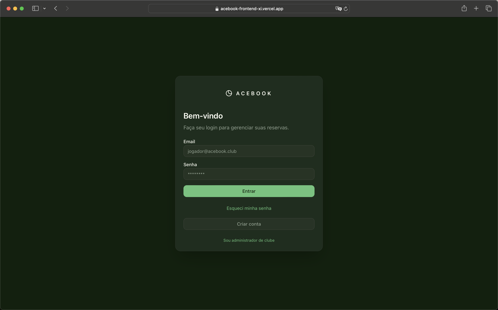
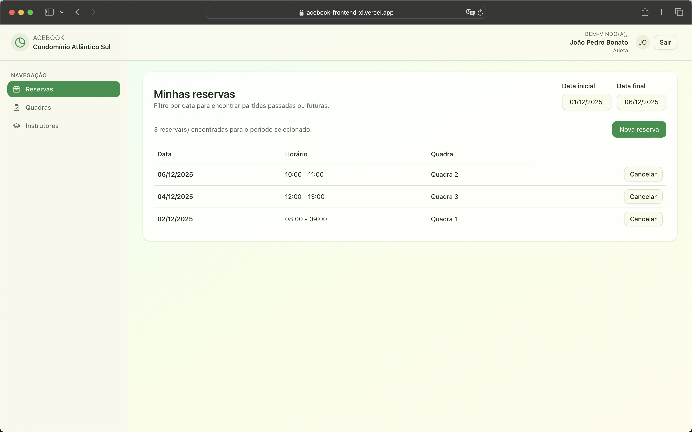
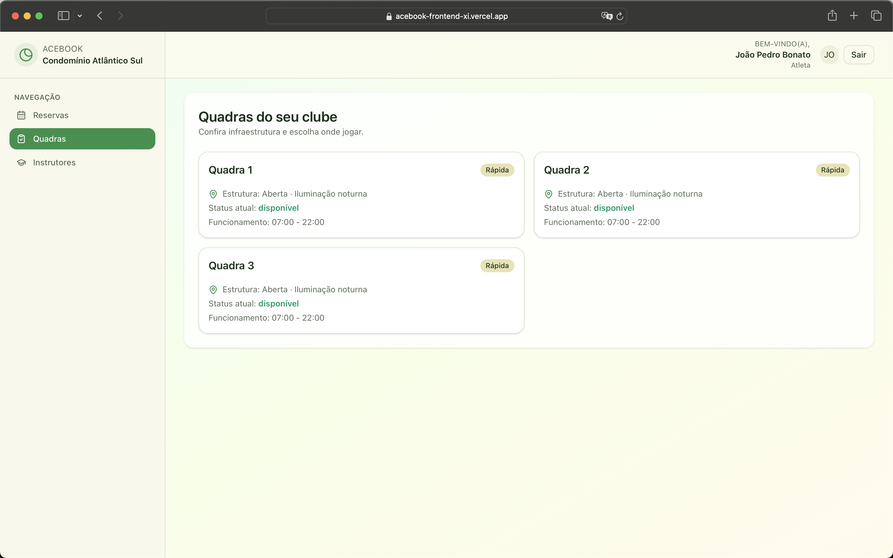

# AceBook Frontend

## Overview

- **Stack**: Next.js 16 (App Router) com TypeScript, Tailwind v4 e componentes do shadcn/ui.
- **Rotas**:
  - `/` portal do atleta (login direto para clientes).
  - `/login` painel de administradores do clube.
  - `/register/player` e `/register/admin` para criação de contas (cada uma com seu formulário).
  - `/forgot-password`, `/reset-password` para gerenciamento de senha.
  - `/dashboard/*` quadras, reservas, usuários.
- **Mock data**: `src/lib/mock-data.ts` fornece dados temporários até a integração com o backend.
- **Contratos de API**: definidos em `src/lib/api.ts` apontando para `http://localhost:8000/api` (pode ser sobrescrito via `NEXT_PUBLIC_API_BASE_URL`).

## Requisitos

- Node.js 20.x (necessário para Next.js 16 + React 19).
- npm 10.x ou superior (ou outro gerenciador compatível como pnpm).
- Backend Django acessível em `http://localhost:8000/api` ou outra URL configurada via `NEXT_PUBLIC_API_BASE_URL`.
- Arquivo `.env.local` com a variável `NEXT_PUBLIC_API_BASE_URL`.

## Como rodar

```bash
npm install
npm run dev
# abra http://localhost:3000
```

## URL publicada

`https://acebook-frontend-xi.vercel.app/`

## Relato do projeto

O Acebook é um sistema de reservas de quadras feito para conectar atletas, instrutores e administradores de clubes.

### Escopo desenvolvido

- Landing page com direcionamento para atletas e administradores.
- Fluxos de cadastro separados (`/register/player` e `/register/admin`).
- Login de administradores e jogadores compartilhando o mesmo contexto de autenticação (`useAuth`).
- Reserva de quadras com formulário intuitivo.
- Listagem das quadras com suas características e horário de funcionamento.
- Página de contatos dos instrutores do clube.
- [Admin] Gerenciamento de quadras, reservas, usuários e instrutores.
- Integração preparada com o backend Django via `src/lib/api.ts`.

## Manual do usuário

1. **Primeiro acesso**: abra `http://localhost:3000`. A tela inicial apresenta botões para login ou cadastro.
2. **Cadastro de clube**: use `/register/admin` e informe os dados do clube.
3. **Cadastro de jogador**: acesse `/register/player`, e preencha os dados pessoais. Se ainda não possuir um código de clube, crie um clube antes.
4. **Login**: Insira seu login e senha.
5. **Uso do dashboard**: Use os cards do dashboard ou o menu de navegação para acessar a página desejada.
6. **Regras das reservas**: Reservas só podem ser feitas no mesmo dia em que se deseja jogar (administradores não têm restrição de data na reserva).

## Capturas de tela





## Resultados

- **Funcionou**:
  Login de administrador/jogador, cadastros de usuário, visualização de quadras no dashboard e CRUD de reservas, quadras, instrutores e usuários.
  Alterações no horário ou status (disponível/manutenção) da quadra refletem corretamente no fluxo de reserva de quadra.

- **Não funcionou**:
  Fluxo de recuperação de senha (`/forgot-password` e `/reset-password`) persiste dando Internal Server Error.

João Pedro Bonato - 2210028
